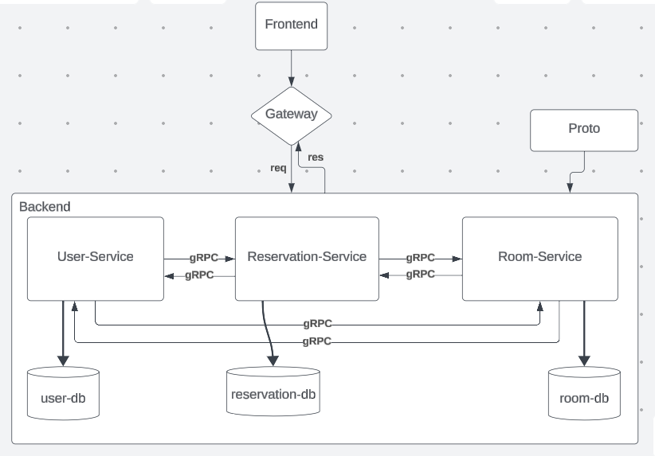

### GROUPE SOA - M2 GB - RESERVATION SALLE 
- **2197** RANJAKASOA Raphaël Marcellin
- **2156** HANTANIAINA Ravelomanana Rolande
- **2198** RAJAONARIVONY Sylvio Jerry
- **2158** MITONDRASOA Samuel Frédéric

### STRUCTURE DU PROJET


### TECHNOLOGIES & BASE DE DONNEES

- **React** - [reactjs.org](https://reactjs.org/)

    `React` est un framework JavaScript open-source qui permet de construire des applications interactives. 

- **Express Gateway**

    `Express Gateway` est une solution open source qui fournit une passerelle d'API (`API Gateway`) construite sur Node.js et Express.js. Son objectif est de simplifier la gestion et la sécurisation des API, ainsi que de faciliter la création d'écosystèmes de microservices.

- **Express** - [expressjs.com](https://expressjs.com/)

    `Express` est un framework rapide, minimaliste et flexible pour Node.js qui est largement utilisé pour construire des applications web notamment pour la partie backend de l'application. 

- **gRPC** - [grpc.io](https://grpc.io/)

    `gRPC` est un framework RPC (Remote Procedure Call) open-source développé par Google. Il permet aux applications client-serveur de communiquer de manière efficace et fiable, même à travers des réseaux distants. 

    `gRPC` utilise HTTP/2 comme protocole sous-jacent, offrant ainsi des performances améliorées, la prise en charge de la multiplexage et la possibilité de traiter les appels de manière asynchrone.

    Dans ce projet, les fichiers `.proto` se trouve dans le dossier `./protos`.

- **Prisma** - [prisma.io](https://prisma.io/)

    `Prisma` est un `ORM` (Object-Relational Mapping) moderne et open source qui facilite l'accès et la gestion des bases de données dans les applications. Conçu pour être utilisé avec TypeScript ou JavaScript, Prisma offre une approche déclarative pour interagir avec les bases de données relationnelles.

- **MySQL** - [mysql.com](https://www.mysql.com/)

    `MySQL` est un serveur de bases de données open-source.

- **Docker** - [docker.com](https://www.docker.com/)

    `Docker` est un environnement de virtualisation de conteneurs.

### INSTALLATION DES DEPENDANCES [NO DOCKER]
```bash
    # gateway
    cd gateway & npm install

    # main
    cd main & npm install

    # room-service  
    cd room-service & npm install

    # user-service
    cd user-service & npm install

    # reservation-service
    cd reservation-service & npm install
```
### MIGRATIONS [NO DOCKER]
```bash
    # gateway
    cd gateway & npm run migrate

    # main
    cd main & npm run migrate

    # room-service  
    cd room-service & npm run migrate

    # user-service
    cd user-service & npm run migrate

    # reservation-service
    cd reservation-service & npm run migrate
```

### LAUNCH APP [NO DOCKER]

- Run Gateway [Optional]
    ```bash
        cd gateway & npm start
    ```

- Run Main Service
    ```bash
        cd main
        npm run start-dev # dev
        npm run start # prod
    ```

- Without the API Gateway:
    * user-service run @`localhost:8081`
    * room-service run @`localhost:8082`
    * reservation-service run @`localhost:8083`

- With the API Gateway:
    * server run @`localhost:8080`

`Ecole Nationale d'Informatique, 2023 - 2024`

